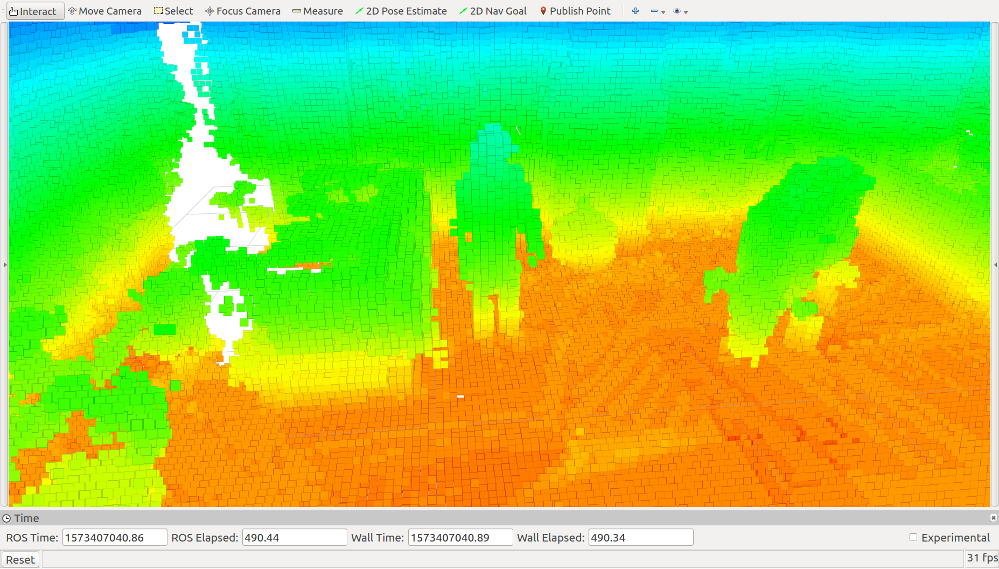
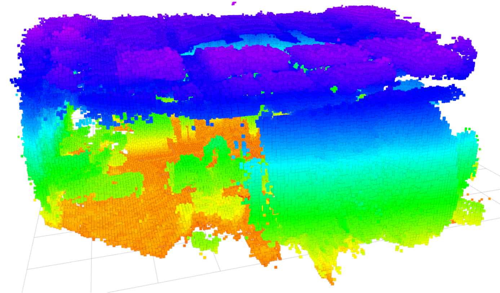
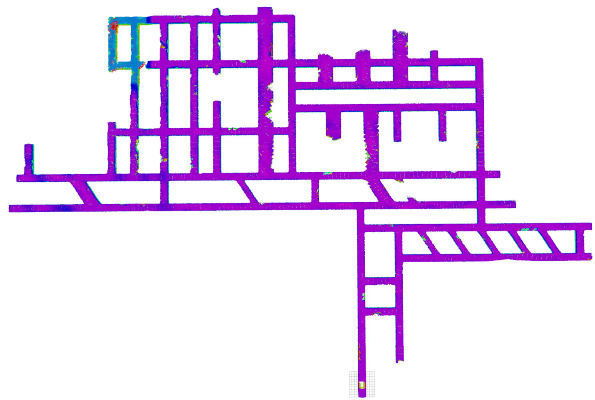

# VDB-EDT: An Efficient Euclidean Distance Transform Algorithm Based on VDB Data Structure

# The video demonstration for ICRA-2021 paper can be found here https://youtu.be/Bojh6ylYUOo

VDB-EDT is an efficient and robust library for large-scale occupancy grid mapping and Euclidean distance transform.  Compared with the state-of-the-art method, VDB-EDT can provide high-quality and more complete mapping results, while consuming less memory and processing time. 

## Installation

1.  This package is developed based on ROS Kinetic and the Eigen3 library is also needed.

2.  Dependencies for OpenVDB and the Catkin wrapper

   `sudo apt-get install libglfw3-dev libblosc-dev libopenexr-dev`

   `sudo apt-get install liblog4cplus-dev`

3. Download this package and go to the VDB-EDT folder

   `cd src`

   `catkin_init_workspace`

   `cd ..`

   `catkin build`    (currently not support `catkin_make` command )

### Download Dataset

1. Please click [here](http://robotics.ethz.ch/~asl-datasets/iros_2017_voxblox/data.bag) to download the cow-and-lady dataset.

     

       
     

2. Please click [here](https://mycuhk-my.sharepoint.com/:u:/g/personal/1155067732_link_cuhk_edu_hk/EfiG1KdwOJhBmikf4UDK4mUBmxY72u9surIum8sM1XBMIg?e=zNkECW) to download the large-scale SubT dataset (background grid is with a size of 50m*50m).

     

       
     

   

### Run VDB-EDT

1. Make sure the current path is at VDB-EDT folder, i.e., in the catkin workspace

   `soource devel/setup.bash`

   `roslaunch vdb_edt VDB-EDT.launch`

2. Play the cow-and-lady dataset. There exist a severe synchronization problem in this dataset. To sufficiently process this dataset, a play rate of 0.1 is recommended

   `rosbag play data.bag -r 0.1 ` 

3. After finishing testing cow-and-lady dataset,  play the SubT dataset

   `rosbag play SubT.bag`

### Results

  

  
  Results on cow-and-lady dataset
  

  

  
  Results on SubT dataset
  

### Acknowledgement

The VDB Ros Wrapper inside this package is developed by Rohit Garg from Air Lab CMU based on the work of ETHZ ASL. We give our special acknowledgement to him. 
